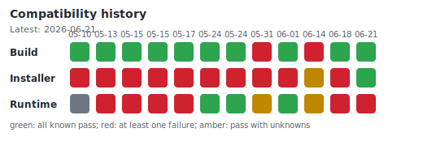

# tt-metal Community Distribution Matrix

A compatibility guardrail that continuously monitors whether [tt-metal](https://github.com/tenstorrent/tt-metal) and the official [tt-installer](https://github.com/tenstorrent/tt-installer) build successfully on community Linux distributions that are **not part of Tenstorrent's official CI**.

> ⚠️ This project is an unofficial, community-maintained compatibility tracker. It is not affiliated with Tenstorrent. Results are gathered in containerized environments without access to physical Tenstorrent hardware; "success" means the build / install pipeline completes per upstream CI conventions.

## Compatibility Status

<!-- COMPAT_TABLE_START -->
*The table below is auto-generated by CI. Last update timestamp and tested commit appear above the table.*

**Last updated:** 2026-06-16 14:31 UTC
**Tested tt-metal:** [`main@b33c15b`](https://github.com/tenstorrent/tt-metal/commit/b33c15b0f07213d738dcf257c4eb53fefddb1e98)

| Distribution | Vanilla | With patches | Runtime ttsim | Logs |
|---|:-:|:-:|:-:|---|
| Linux Mint 22.3 | ✅ | ✅ ([2 patches](patches/linuxmint/)) | ✅ (`risc-compute`) | [run](https://github.com/tetsuh/tt-metal-community-distro-matrix/actions/runs/27622211979) |
| Linux Mint 22.2 | ✅ | ✅ ([2 patches](patches/linuxmint/)) | ✅ (`risc-compute`) | [run](https://github.com/tetsuh/tt-metal-community-distro-matrix/actions/runs/27622211979) |
| Linux Mint 22.1 | ✅ | ✅ ([2 patches](patches/linuxmint/)) | ✅ (`risc-compute`) | [run](https://github.com/tetsuh/tt-metal-community-distro-matrix/actions/runs/27622211979) |
| Linux Mint 21.3 | ✅ | ✅ ([2 patches](patches/linuxmint/)) | ✅ (`risc-compute`) | [run](https://github.com/tetsuh/tt-metal-community-distro-matrix/actions/runs/27622211979) |
| Ubuntu 26.04 | ❌(deps) | ✅ ([4 patches](patches/ubuntu/)) | ❌(runtime) (`risc-compute`) | [run](https://github.com/tetsuh/tt-metal-community-distro-matrix/actions/runs/27622211979) |
| Debian 13 | ❌(deps) | ✅ ([5 patches](patches/debian/)) | ✅ (`risc-compute`) | [run](https://github.com/tetsuh/tt-metal-community-distro-matrix/actions/runs/27622211979) |
| Debian 12 | ❌(deps) | ✅ ([5 patches](patches/debian/)) | ✅ (`risc-compute`) | [run](https://github.com/tetsuh/tt-metal-community-distro-matrix/actions/runs/27622211979) |
| Rocky Linux 10 | ❌(workflow) | ❌(workflow) (no patches) | — | [run](https://github.com/tetsuh/tt-metal-community-distro-matrix/actions/runs/27622211979) |
| Rocky Linux 9 | ❌(deps) | ✅ ([3 patches](patches/rocky/)) | ✅ (`risc-compute`) | [run](https://github.com/tetsuh/tt-metal-community-distro-matrix/actions/runs/27622211979) |
<!-- COMPAT_TABLE_END -->

### tt-installer verification (install phase)

The build pipeline above only exercises the deps/build path of `tt-metal` itself. As a separate phase, we also exercise the official [`tt-installer`](https://github.com/tenstorrent/tt-installer) on each distro it claims to support, to confirm that the Tenstorrent system-level package repository can be configured end-to-end on a clean base image. Hardware-bound steps (KMD, hugepages, firmware flash, container runtime, Metalium/Forge containers) are skipped — this is a guardrail against regressions in repo registration and base-package install, not a substitute for a real Tenstorrent host.

<!-- INSTALL_TABLE_START -->
*Auto-generated. tt-installer phase is opt-in per OS; rows marked `—` are not yet wired into CI.*

| Distribution | Vanilla | With patches | Logs |
|---|:-:|:-:|---|
| Linux Mint 22.3 | ❌(install) (`v2.2.1`) | ❌(install) ([1 patch](patches/linuxmint/installer/)) | [run](https://github.com/tetsuh/tt-metal-community-distro-matrix/actions/runs/27622211979) |
| Linux Mint 22.2 | ❌(install) (`v2.2.1`) | ❌(install) ([1 patch](patches/linuxmint/installer/)) | [run](https://github.com/tetsuh/tt-metal-community-distro-matrix/actions/runs/27622211979) |
| Linux Mint 22.1 | ❌(install) (`v2.2.1`) | ❌(install) ([1 patch](patches/linuxmint/installer/)) | [run](https://github.com/tetsuh/tt-metal-community-distro-matrix/actions/runs/27622211979) |
| Linux Mint 21.3 | ❌(install) (`v2.2.1`) | ❌(install) ([1 patch](patches/linuxmint/installer/)) | [run](https://github.com/tetsuh/tt-metal-community-distro-matrix/actions/runs/27622211979) |
| Ubuntu 26.04 | ❌(install) (`v2.2.1`) | ❌(install) ([1 patch](patches/ubuntu/installer/)) | [run](https://github.com/tetsuh/tt-metal-community-distro-matrix/actions/runs/27622211979) |
| Debian 13 | ❌(install) (`v2.2.1`) | ❌(install) (no patches) | [run](https://github.com/tetsuh/tt-metal-community-distro-matrix/actions/runs/27622211979) |
| Debian 12 | ❌(install) (`v2.2.1`) | ❌(install) (no patches) | [run](https://github.com/tetsuh/tt-metal-community-distro-matrix/actions/runs/27622211979) |
| Rocky Linux 10 | — | — | — |
| Rocky Linux 9 | ✅ (`v2.2.1`) | ✅ (no patches) | [run](https://github.com/tetsuh/tt-metal-community-distro-matrix/actions/runs/27622211979) |
<!-- INSTALL_TABLE_END -->

### Hardwareless ttsim smoke

[](https://github.com/tetsuh/tt-metal-community-distro-matrix/actions/workflows/ttsim-smoke.yaml)

This repository also provides a small [`ttsim`](https://github.com/tenstorrent/ttsim) smoke workflow for hardwareless execution coverage. It runs a pair of LLK smoke lanes on a reference Ubuntu 22.04 host, using the simulator version pinned by the checked-out tt-metal tree.

The standalone workflow remains the canonical smoke because it runs on a known-good Ubuntu 22.04 reference host. The distribution matrix also records an experimental, non-gating `risc-compute` ttsim runtime signal after a successful patched build; this is useful for spotting per-distro runtime drift, but failures in that column do not mask the build or install results and are not a substitute for validation on physical devices.

### Legend

| Symbol | Meaning |
|---|---|
| ✅ | Pipeline completed successfully on the latest run |
| ❌ | Pipeline failed; see the linked log for details |
| ❌(patch/deps/build/verify/install/workflow) | Pipeline failed in the named phase |
| ⏳ | Scheduled but not yet executed |
| — | Not applicable for this distribution / phase |

**Columns**

- **Vanilla** — result of running tt-metal's unmodified `install_dependencies.sh` on the target distro. This is the experience an upstream contributor gets without this repo's patches.
- **With patches** — result of the full `install_dependencies.sh` + `build_metal.sh` pipeline after applying the patches in [`patches/<distro>/`](patches/). The cell links to the patch directory and shows how many patches are applied.
- A `(no patches)` annotation in the **With patches** column means the distro builds cleanly upstream and no patches from this repo are needed; the two columns are then by definition identical.

**Install-phase columns** (separate table)

- **Vanilla** — exit status of the official installer's released `install.sh` on the target distro, with all hardware-dependent components disabled. This is what an upstream user gets running the public one-liner.
- **With patches** — exit status of `install.sh` regenerated from `install.m4` with the patches in [`patches/<distro>/installer/`](patches/) applied. The cell links to the patch directory and shows how many installer patches are applied. A `(no patches)` annotation means no installer-level patches are needed for this distro and the two columns are by definition identical.
- The pinned installer version is shown next to the **Vanilla** cell.
- Linux Mint **Vanilla** is expected to fail (❌) because the upstream installer derives the apt repo URL from `VERSION_CODENAME`, which on Mint is the Mint-specific codename (e.g. `wilma`, `xia`, `zara`) rather than the upstream Ubuntu codename. The patch in [`patches/linuxmint/installer/`](patches/linuxmint/installer/) prefers `UBUNTU_CODENAME` and recovers the install (✅).

Patches in this repository are kept as standalone `git format-patch` files so they can be reviewed individually and contributed back upstream. See [patches/README.md](patches/README.md) for the policy and per-patch upstream status.

## Repository layout

```
.
├── README.md             # this file (compatibility table is auto-updated)
├── LICENSE               # Apache-2.0
├── .dockerignore
├── os/                   # per-distribution build environments (see os/README.md)
│   ├── debian/
│   │   ├── 12/Dockerfile
│   │   └── 13/Dockerfile
│   ├── linuxmint/
│   │   ├── 21.3/Dockerfile
│   │   ├── 22.1/Dockerfile
│   │   ├── 22.2/Dockerfile
│   │   └── 22.3/Dockerfile
│   └── rocky/
│       ├── 9/Dockerfile
│       └── 10/Dockerfile
├── history/              # per-run JSON snapshots from scheduled / full-matrix runs
├── docs/                 # contributor docs
└── .github/workflows/    # CI definitions (populated from Burst 1.2)
```

See [`os/README.md`](./os/README.md) for the conventions used in distribution
directories, and [`docs/adding-a-new-os.md`](./docs/adding-a-new-os.md) for the
step-by-step onboarding guide.

## How it works

1. Each supported distribution has a `Dockerfile` under `os/<distro>/<version>/`.
2. GitHub Actions builds these images on weekly scheduled full-matrix runs and on manual dispatches.
3. Inside each container, the `tt-metal` build is executed against a pinned commit (or `main`) using upstream CI conventions adapted for an environment without Tenstorrent hardware.
4. A summary script regenerates the table above and opens a bot PR with both README changes and raw JSON history snapshots.
5. Per-run logs are uploaded as workflow artifacts and linked from the `Logs` column.

## Bot PR review policy

Scheduled runs are automated detection, not automated publication. When a scheduled or full-matrix manual run opens a bot PR, the maintainer reviews the workflow result and README/history diff before squash-merging it. Bot PRs are not auto-merged.

If a run shows only known expected failures, the bot PR can be merged after a light review. If it shows a new failure, inspect the linked logs first; merge the PR when the failure should be published as the current compatibility state, or rerun/close it when the result is a transient infrastructure issue.

Scheduled and full-matrix manual workflow failures also open or update a public
triage issue. See [`docs/ci-failure-notifications.md`](./docs/ci-failure-notifications.md)
for the deduplication and triage policy.

## History

Scheduled and full-matrix manual runs persist raw status snapshots under [`history/runs/<run_id>/`](./history/runs/). Each OS gets one JSON file with the same fields uploaded as the workflow artifact, including phase-aware build, install, and experimental runtime status. [`history/latest.json`](./history/latest.json) points at the newest recorded run, and [`history/index.json`](./history/index.json) keeps a compact run list for future visualization.

<!-- HISTORY_SUMMARY_START -->
*Auto-generated from `history/index.json`.*



| Run | Recorded | tt-metal | Patched build | Installer | Runtime ttsim | Notable failures |
|---|---|---|---:|---:|---:|---|
| [27622211979](https://github.com/tetsuh/tt-metal-community-distro-matrix/actions/runs/27622211979) | 2026-06-16 | `main@b33c15b` | 8/9 | 1/8 (1 unknown) | 7/8 (1 unknown) | Rocky Linux 10 build, Linux Mint 22.3 install, Linux Mint 22.2 install, +6 more |
| [27508516238](https://github.com/tetsuh/tt-metal-community-distro-matrix/actions/runs/27508516238) | 2026-06-14 | `main@c51e69e` | 1/9 | 1/1 (8 unknown) | 1/1 (8 unknown) | Linux Mint 22.3 build (patch), Linux Mint 22.2 build (patch), Linux Mint 22.1 build (patch), +5 more |
| [26745305526](https://github.com/tetsuh/tt-metal-community-distro-matrix/actions/runs/26745305526) | 2026-06-01 | `main@97ca620` | 9/9 | 8/9 | 9/9 | Debian 12 install |
| [26726791702](https://github.com/tetsuh/tt-metal-community-distro-matrix/actions/runs/26726791702) | 2026-05-31 | `main@97ca620` | 7/9 | 6/7 (2 unknown) | 7/7 (2 unknown) | Rocky Linux 10 build (build), Rocky Linux 9 build (build), Debian 12 install |
| [26369579058](https://github.com/tetsuh/tt-metal-community-distro-matrix/actions/runs/26369579058) | 2026-05-24 | `main@b552209` | 9/9 | 8/9 | 9/9 | Debian 12 install |
<!-- HISTORY_SUMMARY_END -->

## Planned distributions

Additional distributions tracked but not yet onboarded into CI will be listed here.

## Adding a new distribution

Use [`docs/adding-a-new-os.md`](./docs/adding-a-new-os.md) for the step-by-step
process. It covers choosing the `os/<distro>/<version>/` path, wiring workflow
inputs, documenting patches, validating a single target, and publishing
full-matrix results.

## Contributing

See [`CONTRIBUTING.md`](./CONTRIBUTING.md) before opening an issue or PR. This
project welcomes reproducible CI/container compatibility improvements, new distro
targets, upstreamable patches, and documentation fixes. It is not a hardware
support or vendor support channel.

## Project context

This is a hobby project run by a single maintainer with informal mentorship from Tenstorrent staff. The roadmap is documented in the private companion repository; the public repository ships only the artifacts (Dockerfiles, CI workflows, status table). For background on the prototype that seeded this work, see [tetsuh/tt-metal-playground-linuxmint](https://github.com/tetsuh/tt-metal-playground-linuxmint).

## License

See [LICENSE](./LICENSE).
